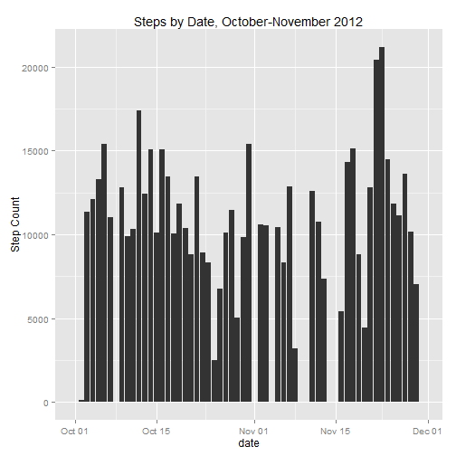
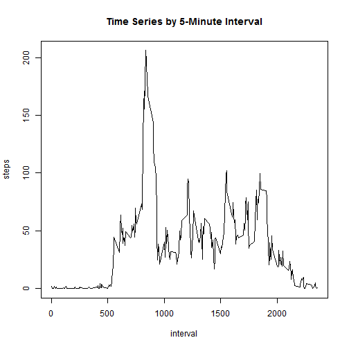
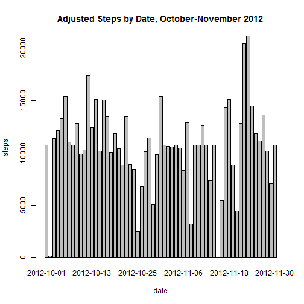

Activity Monitoring Data: October-November 2012
===============================================

This document seeks to analyze data from a personal activity monitoring device. This device collects data at 5 minute intervals through out the day. The data consists of two months of data from an anonymous individual collected during the months of October and November, 2012 and include the number of steps taken in 5 minute intervals each day.

The source for this data can be downloaded from [this url location](https://d396qusza40orc.cloudfront.net/repdata%2Fdata%2Factivity.zip), or found separately in the GitHub repository titled ["activity.zip"](https://github.com/00Christina/RepData_PeerAssessment1/blob/master/activity.zip).

The variables included in this dataset are:

-steps: Number of steps taking in a 5-minute interval (missing values are coded as NA)
-date: The date on which the measurement was taken in YYYY-MM-DD format
-interval: Identifier for the 5-minute interval in which measurement was taken

The dataset is stored in a comma-separated-value (CSV) file and there are a total of 17,568 observations in this dataset.

The following R code reads the data and processes it into a form that is suitable for analysis.


```r
activity <- read.csv("activity.csv")
```

We would like to answer the question: What is the mean number of steps taken per day? To do this, the following R code will make a histogram of the total number of steps taken each day, and then report the mean and median total number of steps per day.


```r
library(dplyr)
library(lubridate)
library(ggplot2)
library(scales)

by_date <- group_by(activity, date)
sum_date <- summarize(by_date, sum_steps = sum(steps))
sum_date$date <- as.Date(sum_date$date)

ggplot(sum_date, aes(x = date, y= sum_steps)) + geom_bar(stat = "identity", position= "dodge") + ylab("Step Count") + ggtitle("Steps by Date, October-November 2012") + scale_x_date(breaks = pretty_breaks())
```

 

```r
mean_step <- mean(sum_date$sum_steps, na.rm=TRUE)
median_step <- median(sum_date$sum_steps, na.rm=TRUE)
mean_median <- merge(mean_step, median_step)
colnames(mean_median) <- c("Mean", "Median")
print(mean_median)
```

```
##       Mean Median
## 1 10766.19  10765
```
Next question is: What is the average daily activity pattern? To answer this, the following R code makes a time series plot of the mean number of steps taken across all days by interval, and then finds the maximum number of steps taken in one interval over that time span.


```r
steps_interval <- aggregate(steps ~ interval, data = activity, FUN = mean)
plot(steps_interval, type = "l", main = "Time Series by 5-Minute Interval")
```

 

```r
max_interval <- steps_interval$interval[which.max(steps_interval$steps)]
print(max_interval)
```

```
## [1] 835
```

Following that, we'd like to impute the missing values that may otherwise affect summarization and analysis of the data. First, we find the total number of rows missing the data, and then use the means of the 5-minute intervals to fill in the missing data. Afterward, we make a histogram with the adjusted data. Again, we report the mean and median values to see if they have changed much by the imputation.


```r
sum(is.na(activity))
```

```
## [1] 2304
```

```r
activity <- merge(activity, steps_interval, by = "interval", suffixes = c("", 
    ".y"))
NAs <- is.na(activity$steps)
activity$steps[NAs] <- activity$steps.y[NAs]
activity <- activity[, c(1:3)]

steps_date <- aggregate(steps ~ date, data = activity, FUN = sum)
barplot(steps_date$steps, main = "Adjusted Steps by Date, October-November 2012", names.arg = steps_date$date, xlab = "date", ylab = "steps")
```

 

```r
mean_steps <- mean(steps_date$steps)
median_steps <- median(steps_date$steps)
mean_medians <- merge(mean_steps, median_steps)
colnames(mean_medians) <- c("Mean", "Median")
print(mean_medians)
```

```
##       Mean   Median
## 1 10766.19 10766.19
```

The final question we'd like to address is: Are there differences in activity patterns between weekdays and weekends? First, we'll create a new factor variable in the dataset with two levels -- "weekday" and "weekend" indicating whether a given date is a weekday or weekend day.

Then, we'll make a panel plot containing a time series plot of the 5-minute interval (x-axis) and the average number of steps taken, averaged across all weekday days or weekend days (y-axis).


```r
dayofweek <- function(date) {
    if (weekdays(as.Date(date)) %in% c("Saturday", "Sunday")) {
        "weekend"
    } else {
        "weekday"
    }
}
activity$dayofweek <- as.factor(sapply(activity$date, dayofweek))

par(mfrow = c(2, 1))
for (type in c("weekend", "weekday")) {
    steps_type <- aggregate(steps ~ interval, data = activity, subset = activity$dayofweek == 
        type, FUN = mean)
    plot(steps_type, type = "l", main = type)
}
```

 

Looking at the two plots, it appears that there is more activity on the weekends than during the weekday.
